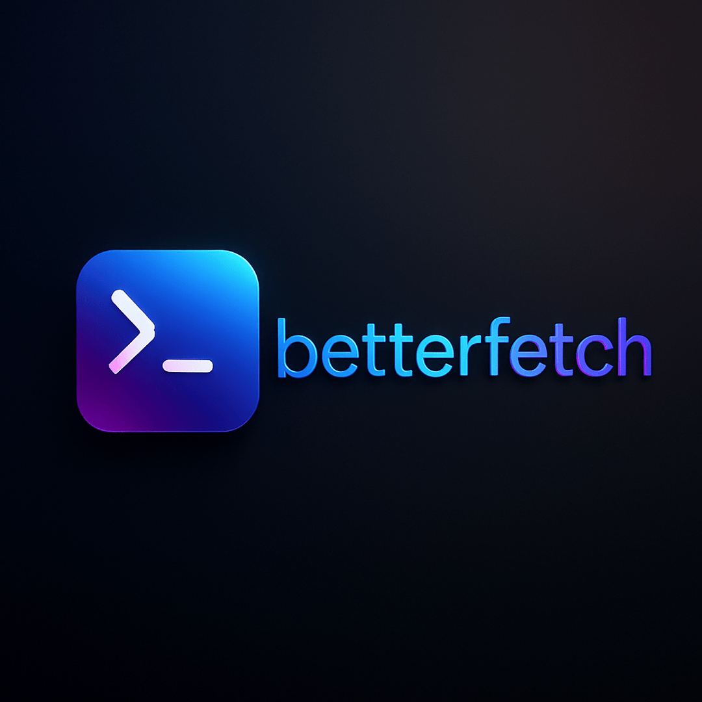

# <center>🚀 betterfetch</center>
<!-- <center></center> -->
<a href=https://github.com/betterfetch/betterfetch>

</a>
</br>

<strong>betterfetch</strong> is a lightweight and minimalist system information tool designed for the terminal.  
It provides essential system details in a clean and efficient manner, enhancing your command-line experience

---

## 🧩 Features

- Displays key system information quickly
- Minimalist design without unnecessary clutter
- Lightweight and fast
- Easy to install and use

---

## 📦 Installation

How to install betterfetch

### To install the Rust version (recommended)

#### Use the provided install script

```bash
curl https://betterfetch.github.io/scripts/rs/install.sh | bash
```

#### Manual install

1. clone the repo

```bash
git clone https://github.com/betterfetch/betterfetch.git
```

2. install using cargo

```bash
cd betterfetch
cargo install --path .
```

3. Add to path

```bash
# Add this to your ~/.zshrc or ~/.bashrc
export PATH="$HOME/.cargo/bin:$PATH"
```

3. Restart your shell

```bash
exec zsh # or bash/fish
```

**you'r good to go**

### For the C++ version

#### Use the provided install script

```bash
curl https://betterfetch.github.io/scripts/cpp/install.sh | bash
```

#### Manual install

```bash
git clone https://github.com/betterfetch/betterfetch-cpp.git
```

```bash
cd betterfetch-cpp
```

```bash
make
sudo make install
```

You can also add it to your PATH
<!-- 
## Join my patreon to support my work

<a href="https://www.patreon.com/c/DavidBalishyan"></a -->
