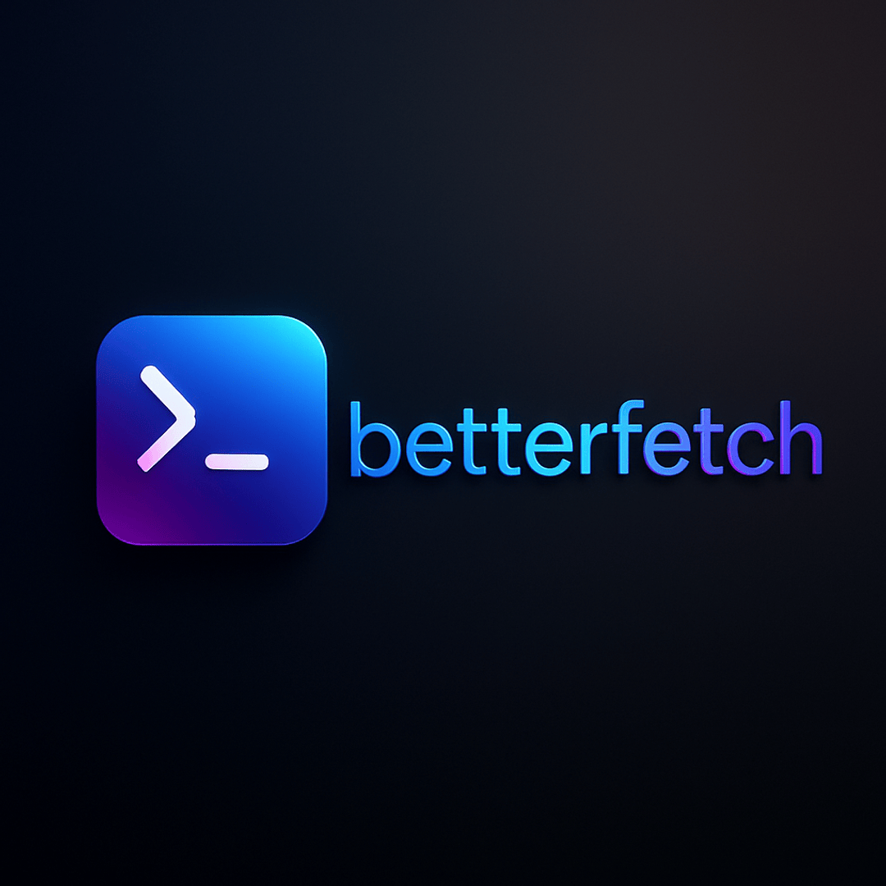

<div align="center">
  <picture>
    <source media="(prefers-color-scheme: dark)" srcset="./betterfetch_logo.png">
    
  </picture>

  # betterfetch

  Lightweight system information, right in your terminal.

  <br>

  <a href="https://github.com/betterfetch/betterfetch">
    
  </a>
  <a href="https://betterfetch.github.io">
    
  </a>

  <br>
  <br>

  <sub>Fast - Minimal - Open Source</sub>
</div>

<br>

---

## Featured

<div align="center">
  <a href="https://github.com/betterfetch/betterfetch">
    
  </a>
  <a href="https://github.com/betterfetch/scripts">
    
  </a>
</div>

<br>

---

## Why betterfetch?

- **Instant** - boots in milliseconds with zero unnecessary overhead
- **Clean** - presents exactly what you need, nothing more
- **Rust** - modern, fast, and dependency-managed
- **Tiny** - minimal footprint, maximal utility

---

## Quick Install

```bash
curl -fsSL https://betterfetch.github.io/scripts/rs/install.sh | bash
```

Or grab the source from the [betterfetch](https://github.com/betterfetch/betterfetch) repository.

<a href="https://betterfetch.github.io">
  <picture>
    <source media="(prefers-color-scheme: dark)" srcset="./website.png">
    
  </picture>
</a>
